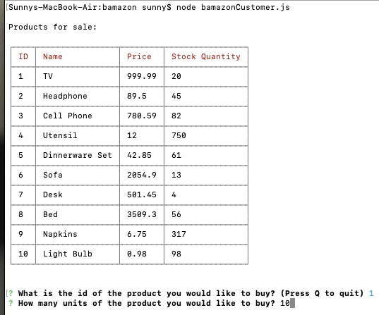
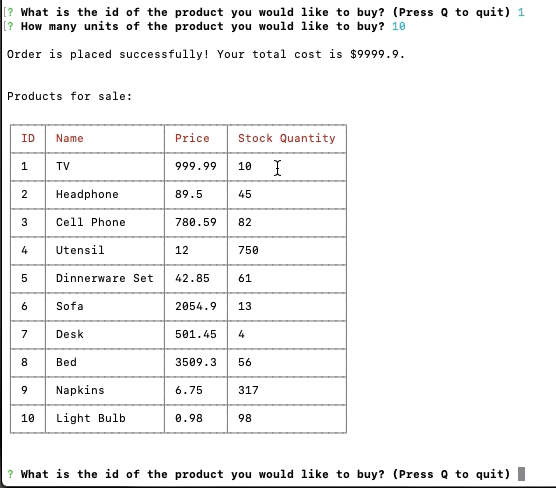
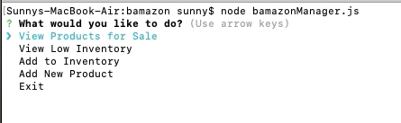
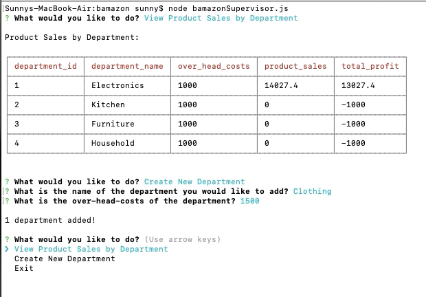

# Bamazon
Bamazon is a command line node app like Amazon storefront that takes in orders from customers and depletes stock from the store's inventory. 
Bamazon also tracks product sales across the store's departments and then provide a summary of the highest-grossing departments in the store.
Bamazon has 3 views:
 * Customer View
 * Manager View
 * Supervisor View


## Technologies Used 
The app is created using node.js and MySQL along with below npm packages:
 * dotenv
 * cli-table
 * inquirer
 * mysql


## Instructions 
```
node bamazonCustomer.js
```
 * This will first display all of the products available for sale.
 * Then it will ask users the id of the product they would like to buy and how many units to buy:
   * If the store doesn't have enough product, it will display a phrase "Insufficient quantity!";
   * If the store has enough product, database will be updated with remaining quantity and customer will be displayed with the total cost of their purchase.

```
node bamazonManager.js
```
 * This will first display a set of menu options managers can do:
   * View Products for Sale
   * View Low Inventory
   * Add to Inventory
   * Add New Product
   * Exit
 * If a manager selects View Products for Sale, it will list all the products.
 * If a manager selects View Low Inventory, it will list all products with an inventory count lower than 5.
 * If a manager selects Add to Inventory, it will display a prompt to let the manager "add more" of any item currently in the store.
 * If a manager selects Add New Product, it will allow the manager to add a completely new product to the store.
 * if a manager selects Exit, it will exit the app.

```
node bamazonSupervisor.js
```
 * This will first display a set of menu options supervisors can do:
   * View Product Sales by Department
   * Create New Department    
   * Exit
 * If a supervisor selects View Product Sales by Department, it will display a summarized table including below fields:
   * department_id
   * department_name
   * over_head_costs
   * product_sales
   * total_profit (the difference between over_head_costs and product_sales)
 * if a supervisor selects Create New Department, it will allow the supervisor to add a new department to the store.
 * if a supervisor selects Exit, it will exit the app.


## Video and Screenshots
Video Demo: https://drive.google.com/file/d/1z4e7VEou7kOHfLSAoFOIMTPXIo5IrRnU/view?usp=sharing

Screenshots:    










## Deployed Link
N/A


## Contributor
The app is developed by [SunnyTong2019](https://github.com/SunnyTong2019).


## License
[MIT](https://choosealicense.com/licenses/mit/)